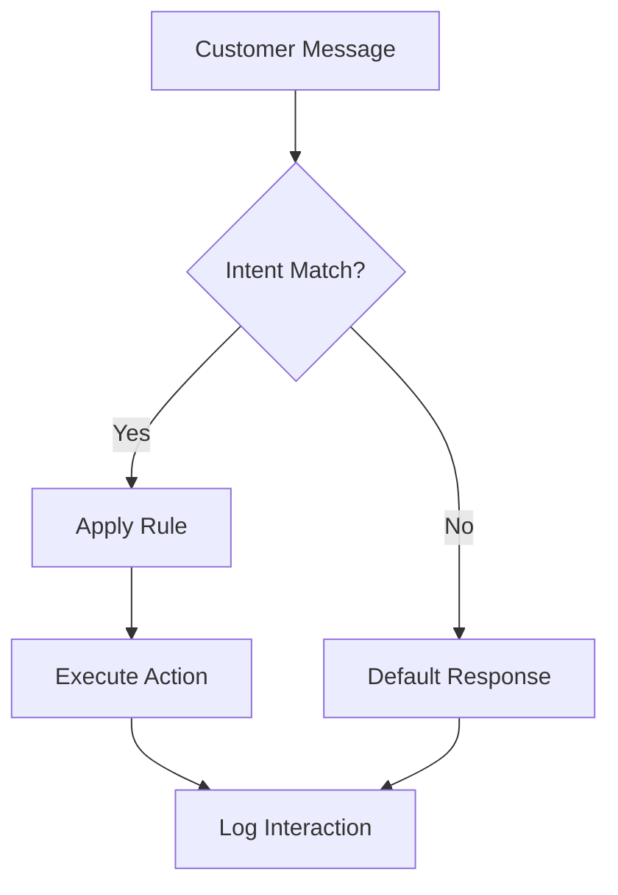

## Overview

Virtuans AI agents handle customer interactions across channels like email, chat, and voice. You customize them through the dashboard or API to match your sales processes. Start by defining core behaviors, then tune performance for optimal results.

<Columns cols={3}>
  <Card title="Customization" icon="settings" href="#agent-customization">
    Tailor agent personalities and responses.
  </Card>
  <Card title="Behavior Rules" icon="brain" href="#behavior-rules">
    Set conditional logic for interactions.
  </Card>
  <Card title="Performance Tuning" icon="trending-up" href="#performance-tuning">
    Optimize speed and accuracy.
  </Card>
</Columns>

## Agent Customization

You begin customization in the Virtuans dashboard. Follow these steps to set up your first agent.

<Steps>
  <Step title="Create Agent" icon="user-plus">
    Navigate to the Agents tab and click "New Agent". Enter a name like "SalesQualifier" and select channels (email, web chat).
  </Step>
  <Step title="Define Personality" icon="mood-happy">
    Choose traits: "empathetic", "assertive", or "informal". Set language preferences, e.g., English (US).
  </Step>
  <Step title="Upload Knowledge Base" icon="database">
    Import your product docs or FAQs as PDFs or CSVs. The agent uses these for context-aware responses.
  </Step>
</Steps>

<Callout kind="tip">
  Test customizations in sandbox mode before going live to avoid disrupting real interactions.
</Callout>

## Behavior Rules

Behavior rules control how agents respond based on customer input. Define them using JSON configuration via API or dashboard.

<CodeGroup tabs="Dashboard JSON,API Patch">
  ```json
  {
    "rules": [
      {
        "trigger": "intent:booking_request",
        "action": "schedule_call",
        "priority": 1,
        "conditions": {
          "customer_tier": ">gold"
        }
      },
      {
        "trigger": "intent:pricing_query",
        "action": "send_pricing_sheet",
        "priority": 2
      }
    ]
  }
  ```
  ```javascript
  // Patch agent config
  await fetch('/api/agents/{agentId}/config', {
    method: 'PATCH',
    headers: { 'Authorization': 'Bearer YOUR_TOKEN' },
    body: JSON.stringify({
      rules: [
        { trigger: 'intent:support', action: 'escalate_human' }
      ]
    })
  });
  ```
</CodeGroup>



## Performance Tuning

Fine-tune agents for better accuracy and speed. Monitor metrics like response time (`<2s` target) and qualification rate.

<Tabs>
  <Tab title="Dashboard Tuning" icon="activity">
    Adjust parameters in the Performance tab:
    
    | Parameter       | Recommended Value | Effect                  |
    |-----------------|-------------------|-------------------------|
    | Max Tokens      | 1500             | Controls response length|
    | Temperature     | 0.7              | Balances creativity     |
    | Top P           | 0.9              | Response diversity      |
    
    Save changes and A/B test against baselines.
  </Tab>
  <Tab title="Advanced API" icon="code">
    Use the tuning endpoint for programmatic adjustments.
    
    <ParamField path="agentId" param-type="string" required="true">
      Your agent identifier, e.g., "sales-qualifier-123".
    </ParamField>
    
    <ParamField query="temperature" param-type="number" required="false">
      Sampling temperature from 0.1 (deterministic) to 1.0 (creative).
    </ParamField>
  </Tab>
</Tabs>

<Expandable title="Scaling for High Volume" default-open="false">
  For `>1000` interactions daily, enable auto-scaling:
  
  ```bash
  curl -X POST '/api/agents/{agentId}/scale' \
    -H 'Authorization: Bearer YOUR_TOKEN' \
    -d '{"min_replicas": 3, "max_replicas": 10}'
  ```
  
  This ensures low latency during peaks.
</Expandable>

<Callout kind="success">
  Regularly review agent logs to refine rules and maintain `>95%` satisfaction scores.
</Callout>