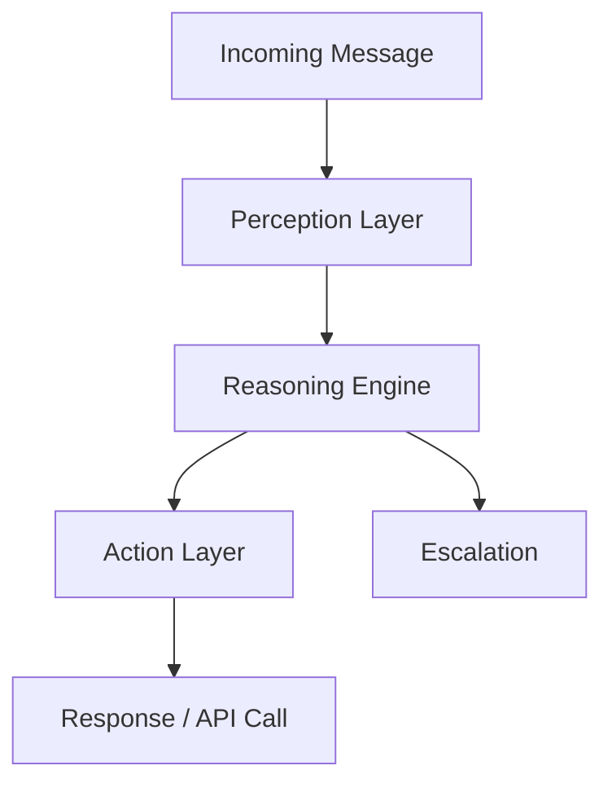

## Overview

Virtuans AI empowers you to automate sales and customer engagement with intelligent agents that operate 24/7. These agents handle inquiries, qualify leads, and book appointments across channels like web chat, email, and SMS. You build agents using a modular architecture that integrates seamlessly with your CRM and tools.

<Columns cols={3}>
  <Card title="AI Agent Architecture" icon="cpu" href="#ai-agent-architecture">
    Understand the core components powering your agents.
  </Card>
  <Card title="Multi-channel Support" icon="smartphone" href="#multi-channel-support">
    Engage customers wherever they are.
  </Card>
  <Card title="Automation Workflows" icon="zap" href="#automation-workflows">
    Streamline tasks with no-code workflows.
  </Card>
</Columns>

## AI Agent Architecture

Virtuans AI agents consist of three core layers: perception, reasoning, and action. The perception layer processes incoming messages from any channel. The reasoning engine uses natural language understanding to interpret intent and context. The action layer executes responses, API calls, or escalations.



<Callout kind="info">
  Agents maintain conversation state across sessions, ensuring context persists for `<24 hours` by default.
</Callout>

## Multi-channel Support

You deploy agents to multiple channels without changing configurations. Virtuans normalizes inputs from web chat, email, SMS, and voice into a unified message format.

<Tabs>
  <Tab title="Web Chat" icon="globe">
    Embed agents on your site using a simple script.

    ```html
    <script src="https://agents.virtuans.ai/embed.js?agentId=your-agent-id"></script>
    <div id="virtuans-chat"></div>
    ```

    Customize appearance with CSS variables like `--brand-color: #040404`.
  </Tab>
  <Tab title="Email" icon="mail">
    Forward emails to a Virtuans inbox for automated replies.

    ```yaml
    channel: email
    inbox: sales@yourcompany.com
    agentId: lead-qualifier
    ```
  </Tab>
  <Tab title="SMS" icon="phone">
    Connect via Twilio webhook for text interactions.

    ```javascript
    app.post('/sms', async (req, res) => {
      const response = await virtuans.handleSMS(req.body.From, req.body.Body);
      res.send(response);
    });
    ```
  </Tab>
</Tabs>

## Automation Workflows

Create workflows to automate repetitive tasks like lead qualification. You define triggers, conditions, and actions visually in the Virtuans dashboard.

<Steps>
  <Step title="Define Trigger" icon="bell">
    Select events like "new message" or "user mentions booking".
  </Step>
  <Step title="Add Conditions" icon="filter">
    Check criteria such as `intent > 0.8` or CRM status.
  </Step>
  <Step title="Execute Actions" icon="play">
    Send Slack notifications, update HubSpot, or book calendars.
  </Step>
</Steps>

<CodeGroup tabs="JSON,YAML">
  ```json
  {
    "trigger": "new_lead",
    "conditions": [{ "field": "score", "operator": ">", "value": 70 }],
    "actions": [
      { "type": "crm_update", "record": "lead_id" },
      { "type": "email", "template": "qualified-lead" }
    ]
  }
  ```
  ```yaml
  trigger: new_lead
  conditions:
    - field: score
      operator: ">"
      value: 70
  actions:
    - type: crm_update
      record: lead_id
    - type: email
      template: qualified-lead
  ```
</CodeGroup>

<Expandable title="Advanced Workflow Tips" default-open="false">
  Chain workflows for complex logic. Use `{context.userId}` variables to pass data between steps. Monitor performance via the analytics dashboard for optimization.
</Expandable>

<Callout kind="tip">
  Start with simple workflows for lead qualification before scaling to full sales automation.
</Callout>