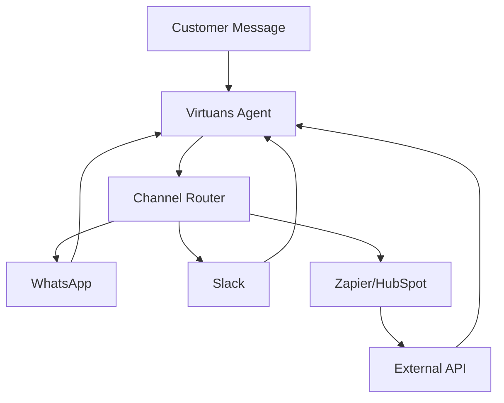

## Overview

Virtuans AI supports seamless integration with popular communication channels and third-party tools. You connect these services to enable your AI agents to handle customer interactions across WhatsApp, Slack, web chat, Zapier, HubSpot, and custom APIs. This expands your engagement ecosystem while maintaining 24/7 availability.

<Columns cols={3}>
  <Card title="Communication Channels" icon="message-circle" href="#channels">
    Set up WhatsApp, Slack, and web chat for direct customer messaging.
  </Card>
  <Card title="Third-Party Tools" icon="zap" href="#third-party">
    Integrate with Zapier and HubSpot for workflow automation.
  </Card>
  <Card title="Custom APIs" icon="code" href="#api">
    Build bespoke connections using our REST API.
  </Card>
</Columns>

<Callout kind="tip">
  Ensure you have admin access to your target services before starting. All integrations use secure OAuth 2.0 or API keys.
</Callout>

## Supported Channels

Connect Virtuans to messaging platforms where your customers already engage. Follow these steps for each channel.

<Tabs>
  <Tab title="WhatsApp" icon="message-circle">
    <Steps>
      <Step title="Get Credentials" icon="key">
        Log in to the Meta for Developers portal and create a WhatsApp Business App. Note your `{PHONE_NUMBER_ID}` and `{ACCESS_TOKEN}`.
      </Step>
      <Step title="Configure in Virtuans" icon="settings">
        Navigate to your Virtuans dashboard > Integrations > Channels. Select WhatsApp and paste your credentials.
      </Step>
      <Step title="Test Connection" icon="play">
        Send a test message to your phone number. Verify the AI responds within `<5s`.
      </Step>
    </Steps>
  </Tab>
  <Tab title="Slack" icon="hash">
    <Steps>
      <Step title="Create Slack App" icon="plus">
        Go to api.slack.com/apps and create a new app. Add bot scopes like `chat:write`.
      </Step>
      <Step title="Add to Virtuans" icon="settings">
        Copy the Bot User OAuth Token and Bot User ID. Enter them in Virtuans Integrations > Slack.
      </Step>
      <Step title="Invite Bot" icon="users">
        Invite the bot to your channel with `/invite @your-bot`.
      </Step>
    </Steps>
  </Tab>
</Tabs>

## Third-Party Integrations

Extend Virtuans with no-code tools for advanced automation.

<Tabs>
  <Tab title="Zapier" icon="zap">
    <p>Create Zaps to trigger Virtuans agents from 5000+ apps.</p>

    <CodeGroup tabs="Trigger,Action">
      ```json
      // Zapier Trigger: New Lead
      {
        "event": "lead.created",
        "data": {
          "email": "lead@example.com",
          "name": "John Doe"
        }
      }
      ```
      ```json
      // Virtuans Action: Qualify Lead
      {
        "agent_id": "agt_123456",
        "input": "{{zapier.lead_data}}"
      }
      ```
    </CodeGroup>
  </Tab>
  <Tab title="HubSpot" icon="package">
    <p>Sync contacts and deals automatically.</p>

    <Steps>
      <Step title="API Key Setup">
        Generate a private app token in HubSpot > Settings > Integrations > Private Apps.
      </Step>
      <Step title="Virtuans Sync">
        In Virtuans, go to Integrations > CRM > HubSpot. Enter your token and select sync fields like contacts and deals.
      </Step>
    </Steps>
  </Tab>
</Tabs>

## Custom API Connections

For advanced use cases, integrate via our REST API. All endpoints use HTTPS and Bearer token auth.

<Request tabs="JavaScript,cURL" show-lines="true">
  ```javascript
  const response = await fetch('https://api.virtuans.ai/v1/channels/custom', {
    method: 'POST',
    headers: {
      'Authorization': `Bearer ${YOUR_API_KEY}`,
      'Content-Type': 'application/json'
    },
    body: JSON.stringify({
      name: 'Custom Webhook',
      webhook_url: 'https://yourapp.com/webhook'
    })
  });
  ```
  ```bash
  curl -X POST https://api.virtuans.ai/v1/channels/custom \
    -H "Authorization: Bearer $YOUR_API_KEY" \
    -H "Content-Type: application/json" \
    -d '{
      "name": "Custom Webhook",
      "webhook_url": "https://yourapp.com/webhook"
    }'
  ```
</Request>

<Response tabs="200,400">
```json
{
  "success": true,
  "channel_id": "ch_789abc",
  "status": "active"
}
```

```json
{
  "error": "Invalid webhook_url",
  "code": "INVALID_URL"
}
```
</Response>

### API Parameters

<ParamField path="name" param-type="string" required="true">
  Unique name for your custom channel.
</ParamField>

<ParamField body="webhook_url" param-type="string" required="true">
  Endpoint that receives Virtuans events.
</ParamField>

<ParamField header="Authorization" param-type="string" required="true">
  Bearer token for authentication.
</ParamField>

## Integration Flow



<Expandable title="Troubleshooting Common Issues" default-open="false">
  - **Connection timeouts**: Check firewall rules for `api.virtuans.ai`.
  - **Auth failures**: Regenerate `{API_KEY}` and verify format.
  - **No responses**: Ensure agent is published and channel is active.
</Expandable>