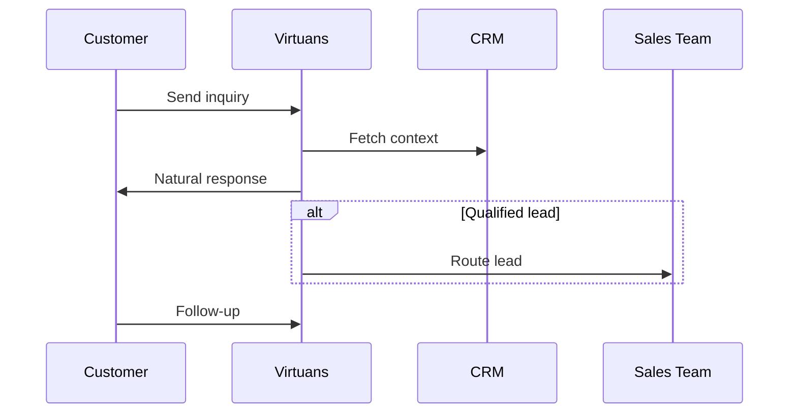

## Overview

Virtuans AI empowers your sales and customer engagement with intelligent agents that operate 24/7 across email, chat, phone, and social channels. You deploy these agents to handle inquiries, qualify leads, book appointments, and nurture relationships without human intervention. Built on advanced language models, Virtuans ensures natural conversations while integrating seamlessly with your CRM and tools.

## Key Benefits

Virtuans delivers measurable results for growing teams. Deploy agents in minutes and scale effortlessly.

<Columns cols={3}>
  <Card title="24/7 Availability" icon="clock" href="/docs/agents">
    Your agents respond instantly, even outside business hours, capturing leads that never sleep.
  </Card>
  <Card title="Multi-Channel Support" icon="message-circle" href="/docs/channels">
    Handle interactions on email, WhatsApp, Slack, and web chat from one dashboard.
  </Card>
  <Card title="CRM Integration" icon="database" href="/docs/integrations">
    Sync data with Salesforce, HubSpot, or custom APIs for seamless workflows.
  </Card>
</Columns>

<Callout kind="success">
  Teams using Virtuans report 40% faster lead response times and 25% higher conversion rates.
</Callout>

## Use Cases

Explore how Virtuans fits your workflows.

<Tabs>
  <Tab title="Sales Automation" icon="shopping-cart">
    Automate outbound outreach and inbound qualification.

    <Steps>
      <Step title="Configure Agent" icon="settings">
        Define your ideal customer profile and scripts.
      </Step>
      <Step title="Integrate CRM" icon="database">
        Connect to your sales tools for real-time data.
      </Step>
      <Step title="Launch Campaign" icon="rocket">
        Monitor performance and optimize with analytics.
      </Step>
    </Steps>
  </Tab>
  <Tab title="Customer Engagement" icon="users">
    Provide instant support and upsell opportunities.

    Agents answer FAQs, resolve issues, and suggest products based on purchase history.
  </Tab>
  <Tab title="Lead Qualification" icon="filter">
    Score and route high-potential leads to your team.

    Use custom scoring rules to prioritize conversations.
  </Tab>
</Tabs>

## Quick Start Integration

Get started with our JavaScript SDK or REST API.

<CodeGroup tabs="JavaScript,Python">
  ```javascript
  import { Virtuans } from '@virtuans/sdk';

  const client = new Virtuans({ apiKey: 'your_api_key' });

  const response = await client.createAgent({
    name: 'Sales Bot',
    channels: ['email', 'chat'],
    instructions: 'Qualify B2B leads for SaaS products.'
  });

  console.log(response.agentId);
  ```
  ```python
  from virtuans import Virtuans

  client = Virtuans(api_key='your_api_key')

  response = client.create_agent(
      name='Sales Bot',
      channels=['email', 'chat'],
      instructions='Qualify B2B leads for SaaS products.'
  )

  print(response.agent_id)
  ```
</CodeGroup>

## Agent Workflow



| Feature | Benefit | Channels Supported |
|---------|---------|--------------------|
| Natural Language | Human-like conversations | Email, Chat, SMS |
| Custom Scripts | Tailor to your brand | WhatsApp, Slack |
| Analytics | Track ROI | All |

<Columns cols={2}>
  <Card title="Documentation" icon="book-open" href="/docs/quickstart">
    Dive into guides and APIs.
  </Card>
  <Card title="Get Started Free" icon="play" href="/signup" target="_blank">
    Create your first agent today.
  </Card>
</Columns>