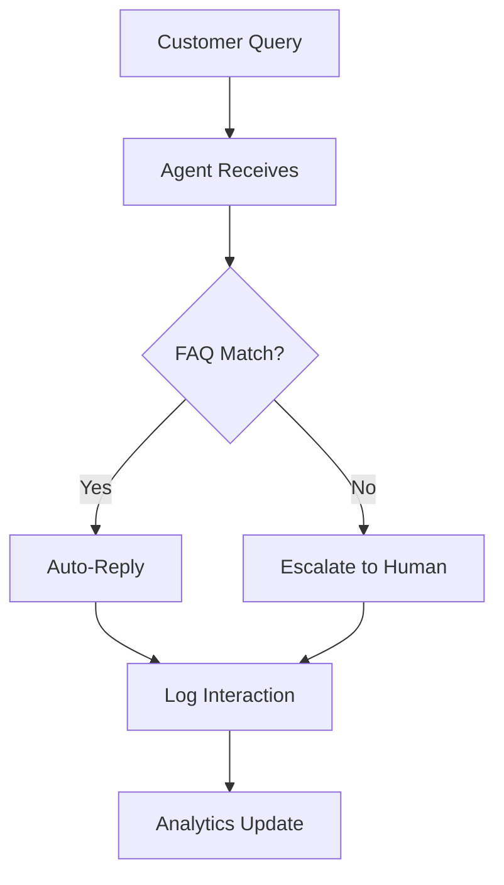

## Overview

Virtuans AI enables you to automate sales and customer engagement with intelligent agents that handle inquiries, book appointments, and qualify leads across channels like chat, email, and voice. Follow these steps to create your account, configure settings, and deploy your first agent in under 10 minutes.

<Columns cols={3}>
  <Card title="24/7 Availability" icon="clock" href="/docs/features/availability">
    Agents respond instantly, day or night.
  </Card>
  <Card title="Multi-Channel" icon="message-circle" href="/docs/features/channels">
    Support web chat, email, SMS, and phone.
  </Card>
  <Card title="Lead Qualification" icon="target" href="/docs/features/qualification">
    Score and route high-value leads automatically.
  </Card>
</Columns>

## Create Your Account

Begin by signing up for a Virtuans account.

<Steps>
  <Step title="Visit Dashboard" icon="globe">
    Go to the [Virtuans dashboard](https://app.virtuans.ai/signup) and click **Sign Up**.
  </Step>
  <Step title="Enter Details" icon="user">
    Provide your email, company name, and password. Verify your email via the confirmation link.
  </Step>
  <Step title="Complete Onboarding" icon="check-circle">
    Answer three quick questions about your business to customize your experience.
  </Step>
</Steps>

<Callout kind="tip">
  Use a business email for account recovery and team invites.
</Callout>

## Initial Setup

Configure your workspace and API access.

<Tabs>
  <Tab title="Dashboard" icon="layout">
    In the dashboard, navigate to **Settings > API Keys**.

    Generate a new key named `production-agent-key`.

    Copy the key securely—it grants full access to your agents.
  </Tab>
  <Tab title="CLI" icon="terminal">
    Install the Virtuans CLI:

    <CodeGroup tabs="npm,yarn">
```bash
npm install -g @virtuans/cli
```
```bash
yarn global add @virtuans/cli
```
    </CodeGroup>

    Authenticate:

````bash
virtuans login
````

    Paste your API key when prompted.
  </Tab>
</Tabs>

## Launch Your First Agent

Create and deploy an agent for customer support.

<Steps>
  <Step title="Create Agent" icon="bot">
    From the dashboard, select **New Agent** > **Customer Support**.

    Name it `support-bot` and select channels: Web Chat, Email.
  </Step>
  <Step title="Configure Prompts" icon="edit-3">
    Set the system prompt:

````javascript
{
  "instructions": "You are a helpful support agent for Virtuans. Book demos, answer FAQs, and qualify sales leads. Always be friendly and concise."
}
````
  </Step>
  <Step title="Test and Deploy" icon="play">
    Use the built-in tester to simulate chats. Click **Deploy** to go live.
  </Step>
</Steps>

<Callout kind="success">
  Your agent is now handling interactions! Monitor performance in the **Analytics** tab.
</Callout>

## Next Steps

<ExpandableGroup>
  <Expandable title="Customize Knowledge Base" default-open="true">
    Upload your product docs to **Knowledge > Sources**. Agents use this for accurate responses.
  </Expandable>
  <Expandable title="Integrate with CRM">
    Connect to HubSpot or Salesforce via **Integrations**. Sync leads automatically.
  </Expandable>
</ExpandableGroup>



Track your first conversations and scale from there. Your Virtuans setup is complete!